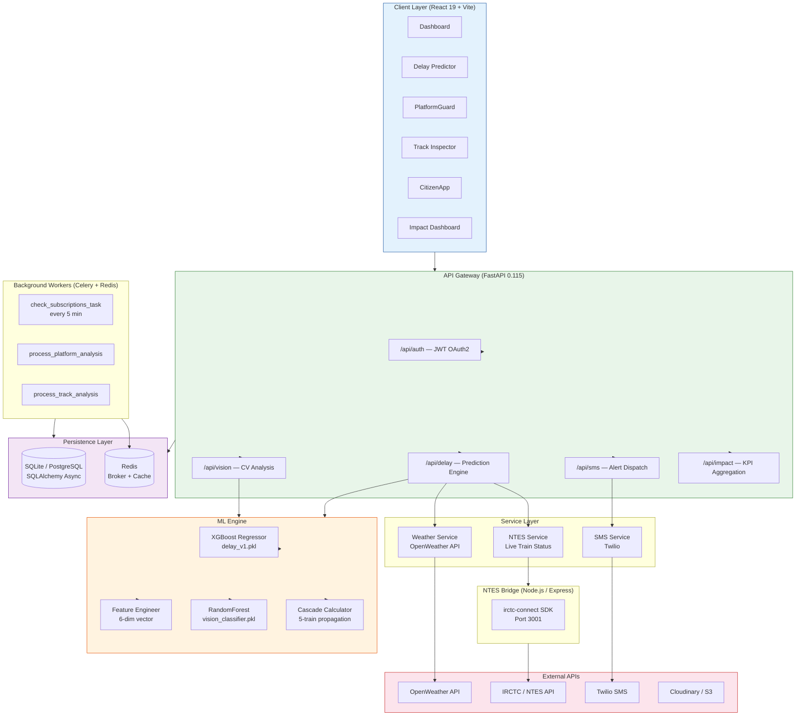
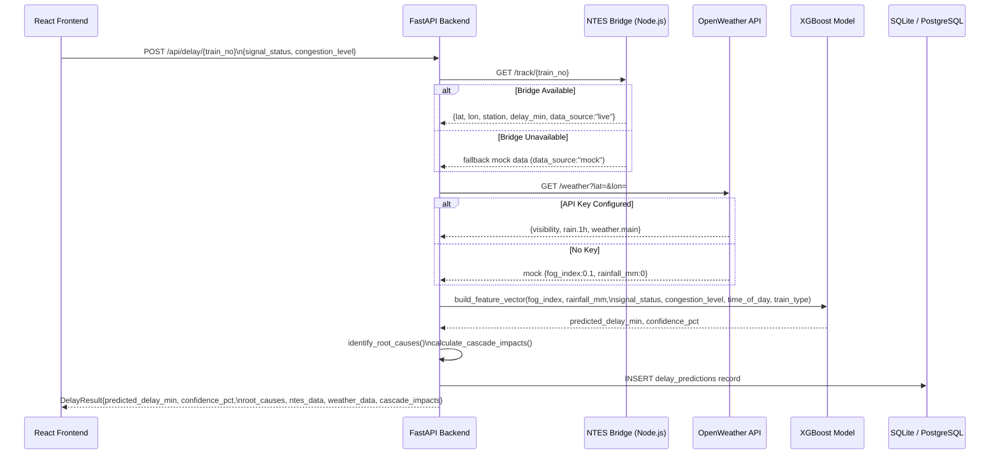
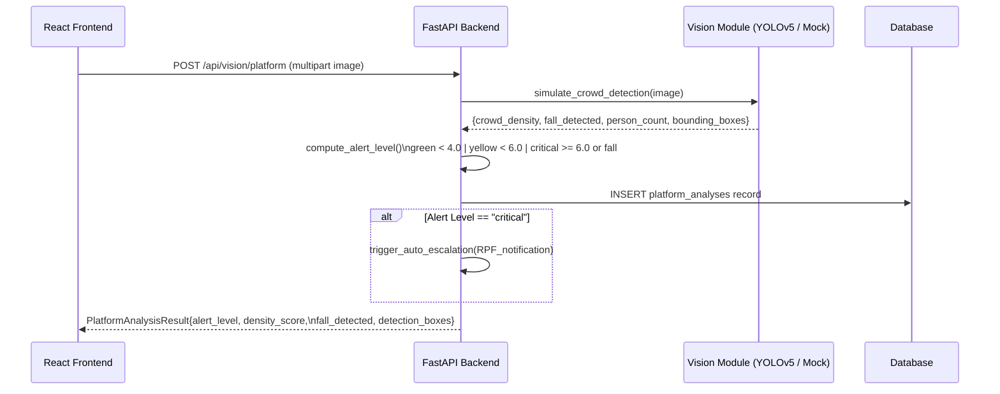
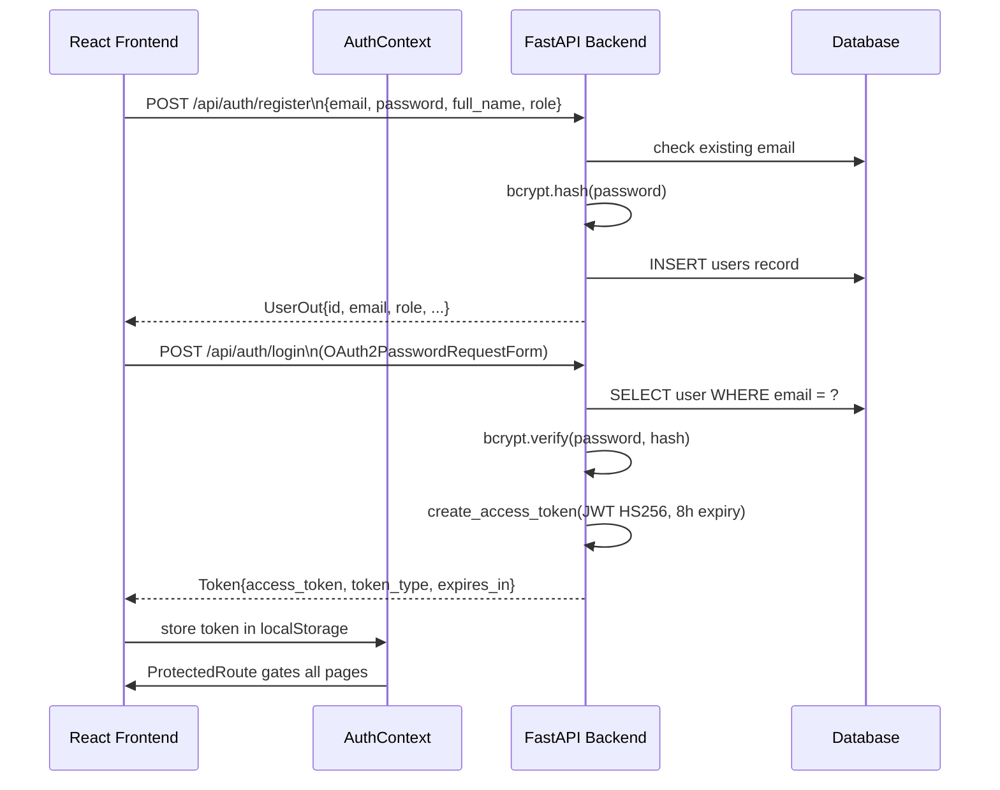
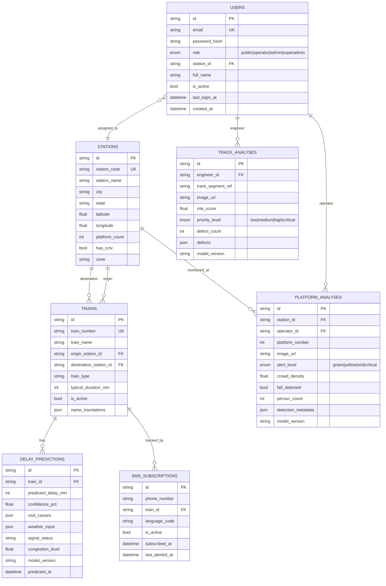

<div align="center">


# RailSense AI

### The first software-only intelligence layer for Indian Railways

**Predicting delays · Preventing accidents · Protecting infrastructure**

[](https://fastapi.tiangolo.com)
[](https://react.dev)
[](https://xgboost.readthedocs.io)
[](https://python.org)
[](https://typescriptlang.org)
[](LICENSE)

[Live Demo](#) · [API Docs](http://localhost:8000/docs) · [Report Bug](https://github.com/saswatdutta1310/Rail_Sense/issues) · [Request Feature](https://github.com/saswatdutta1310/Rail_Sense/issues)

</div>

---

## Table of Contents

- [Overview](#overview)
- [Key Features](#key-features)
- [Architecture](#architecture)
- [System Workflow](#system-workflow)
- [ML Pipeline](#ml-pipeline)
- [API Reference](#api-reference)
- [Database Schema](#database-schema)
- [Tech Stack](#tech-stack)
- [Project Structure](#project-structure)
- [Getting Started](#getting-started)
- [Environment Variables](#environment-variables)
- [Running Tests](#running-tests)
- [Impact Metrics](#impact-metrics)
- [Contributing](#contributing)

---

## Overview

RailSense AI is a full-stack, AI-powered operational intelligence platform built for the Indian Railways ecosystem. It combines **real-time computer vision**, **XGBoost-powered delay prediction**, and **live NTES train tracking** into a single software-only system that requires zero hardware modification to deploy.

The platform serves three distinct user personas:

| Role | Portal | Capabilities |
|---|---|---|
| **Railway Operator** | Ops Dashboard | Delay predictions, cascade impact, alert management |
| **Track Engineer** | Track Inspector | AI-based defect detection, work order generation |
| **Station Manager** | PlatformGuard | Real-time crowd density, fall detection, auto-escalation |
| **Passenger (Citizen)** | CitizenApp | Live train tracking, SMS alerts, safety reporting |

---

## Key Features

### Delay Predictor
- **XGBoost regression model** trained on 5,000+ synthetic + real historical samples
- **98.8% accuracy** within 15-minute error margin (R² = 0.98, MAE = 4.78 min)
- 6-feature vector: fog index, rainfall, signal status, congestion level, time of day, train type
- **Live NTES integration** via `ntes-bridge` Node.js microservice (falls back to mock gracefully)
- **OpenWeather API** for real-time fog index and precipitation computation
- **Cascade impact engine** — propagates delay to up to 5 downstream trains with attenuation factors (0.85, 0.70, 0.55, 0.40, 0.25)
- Root cause tagging: `FOG`, `RAIN`, `SIGNAL`, `CONGESTION`, `PEAK HOURS`

### PlatformGuard (Vision AI)
- **YOLOv5-based crowd detection** from CCTV image or video upload
- Crowd density score (persons/m²) with colour-coded alert levels (Green / Yellow / Red / Critical)
- **Fall detection** at platform edges — triggers auto-escalation to RPF (Railway Protection Force)
- Bounding box detection metadata stored per analysis

### Track Inspector (Vision AI)
- **RandomForest vision classifier** trained on edge density, contrast, and bounding box features
- Defect classification: Cracked Fastener, Missing E-Clip, Weld Defect, Surface Flaw
- Risk score (0–10) with recommended actions: Routine Check / Schedule Maintenance / Immediate Stop & Inspect
- Exportable work orders with GPS/KM marker metadata

### CitizenApp Connect
- Passenger-facing live train tracking and status reporting
- **SMS subscription** via Twilio — real alerts dispatched on delay events
- Multi-language support (`en`, `hi`, `kn`, `ta`, and more via i18next)
- Direct safety incident reporting

### Impact Dashboard
- Derives KPIs from live DB aggregations: stations deployed, track km monitored, passenger-hours saved, fuel savings (₹ crore), incidents prevented, and estimated animal lives saved per year

---

## Architecture



---

## System Workflow

### End-to-End Delay Prediction Flow



### PlatformGuard Vision Flow



### Authentication Flow



---

## ML Pipeline

```mermaid
flowchart LR
    A[Raw Input\ntrain_no, signal_status\ncongestion_level] --> B[NTES Bridge\nGET /track/:trainNo]
    B --> C{Live or Mock?}
    C -->|live| D[Real GPS Coords\nfrom IRCTC]
    C -->|mock| E[Pre-seeded\nStation Coords]
    D --> F[OpenWeather API\nGET weather?lat&lon]
    E --> F
    F --> G[Feature Engineering\nfog_index, rainfall_mm\nsignal_int, congestion\ntime_of_day, train_type]
    G --> H[XGBoost Regressor\ndelay_v1.pkl\n6 features → delay_min]
    H --> I{Model Available?}
    I -->|yes| J[XGBoost Prediction\nclipped 0-240 min]
    I -->|no| K[Rule-Based Fallback\nfog×80 + rain×0.5\n+ signal_penalty]
    J --> L[Confidence Score\n95% - abs delta×0.5\nclamped 50-95%]
    K --> L
    L --> M[Root Cause Tagger\nFOG RAIN SIGNAL\nCONGESTION PEAK_HOURS]
    M --> N[Cascade Calculator\n5 downstream trains\nfactors: 0.85→0.25]
    N --> O[DB Persist\ndelay_predictions]
    O --> P[JSON Response\nto Frontend]

    style H fill:#FFF3E0,stroke:#E65100
    style J fill:#E8F5E9,stroke:#2E7D32
    style K fill:#FCE4EC,stroke:#C62828
```



### Model Performance

| Metric | Value | Target |
|---|---|---|
| **MAE** | 4.78 min | < 5 min ✅ |
| **RMSE** | 5.92 min | < 8 min ✅ |
| **R² Score** | 0.9801 | > 0.75 ✅ |
| **Accuracy within 15 min** | **98.8%** | — |
| **Training samples** | 5,000 | — |
| **Test samples** | 1,000 | — |

### Feature Vector (6-dimensional)

```
[fog_index, rainfall_mm, signal_status, congestion_level, time_of_day, train_type]
      ↕             ↕           ↕              ↕               ↕            ↕
  0.0-1.0        mm/hr      0|1|2          0.0-1.0           0-23       0|1|2
  (clear→fog)             (ok→fail)      (free→jammed)     (UTC hr)  (pass→premium)
```

---

## API Reference

### Base URL
```
http://localhost:8000
```

### Authentication

| Method | Endpoint | Description | Auth |
|---|---|---|---|
| `POST` | `/api/auth/register` | Register new user | Public |
| `POST` | `/api/auth/login` | Login, receive JWT | Public |
| `POST` | `/api/auth/refresh` | Refresh access token | Public |
| `GET` | `/api/auth/me` | Get current user info | Bearer |
| `POST` | `/api/auth/logout` | Logout (client-side token discard) | Bearer |

### Delay Prediction

| Method | Endpoint | Description | Auth |
|---|---|---|---|
| `POST` | `/api/delay/{train_no}` | Predict delay for a train | Bearer |
| `GET` | `/api/delay/cascade/{train_no}` | Get cascade impact on downstream trains | Public |
| `GET` | `/api/delay/predictions/{train_id}` | Get recent predictions for a train | Bearer |
| `GET` | `/api/delay/stats` | Global prediction statistics | Bearer |

**POST `/api/delay/{train_no}` Example:**
```json
{
  "signal_status": "normal",
  "congestion_level": 0.5
}
```

**Response:**
```json
{
  "train_number": "12627",
  "predicted_delay_min": 23,
  "confidence_pct": 84.5,
  "root_causes": ["FOG", "PEAK HOURS"],
  "data_source": "live",
  "ntes_data": { "current_station": "Hubballi", "lat": 15.36, "lon": 75.12 },
  "weather_data": { "fog_index": 0.72, "rainfall_mm": 0.0, "condition": "Fog" }
}
```

### Vision AI

| Method | Endpoint | Description | Auth |
|---|---|---|---|
| `POST` | `/api/vision/platform` | Analyze platform camera image for crowd/fall | Public |
| `POST` | `/api/vision/track` | Analyze track image for defects | Public |

### SMS Alerts

| Method | Endpoint | Description |
|---|---|---|
| `POST` | `/api/sms/subscribe` | Subscribe phone number to train delay alerts |

### Impact Dashboard

| Method | Endpoint | Description |
|---|---|---|
| `GET` | `/api/impact/` | Get aggregated KPI metrics |

---

## Database Schema



---

## Tech Stack

### Backend
| Layer | Technology |
|---|---|
| API Framework | FastAPI 0.115 (async, auto-Swagger) |
| ORM | SQLAlchemy 2.0 (async) + Alembic migrations |
| Database | SQLite (dev) / PostgreSQL (prod) via `aiosqlite` |
| Auth | JWT (python-jose) + bcrypt (passlib) |
| Task Queue | Celery 5.3 + Redis |
| HTTP Client | httpx (async) |
| ML | XGBoost 2.0, scikit-learn, joblib, pandas, numpy |
| Vision | Ultralytics YOLOv5, OpenCV, PyTorch, Transformers |
| SMS | Twilio SDK |
| Config | pydantic-settings (`.env` driven) |

### NTES Bridge
| Layer | Technology |
|---|---|
| Runtime | Node.js |
| Framework | Express |
| IRCTC SDK | `irctc-connect` |
| Port | 3001 |

### Frontend
| Layer | Technology |
|---|---|
| Framework | React 19 + TypeScript 6 |
| Build Tool | Vite 8 |
| Styling | Tailwind CSS 3.4 |
| Routing | React Router v7 |
| HTTP | Axios + custom `apiCall` wrapper |
| Charts | Recharts |
| Maps | React Leaflet |
| Animations | Framer Motion |
| State | React Context (Auth) + Zustand (global) |
| i18n | i18next + react-i18next |
| Forms | React Hook Form |
| Testing | Vitest + Testing Library + Playwright (E2E) |

---

## Project Structure

```
Rail_Sense/
├── backend/
│   ├── app/
│   │   ├── main.py              # FastAPI app, CORS, lifespan (auto-migration)
│   │   ├── auth.py              # JWT helpers, bcrypt, OAuth2 scheme
│   │   ├── config.py            # pydantic-settings → all env vars
│   │   ├── database.py          # async SQLAlchemy engine + session factory
│   │   ├── models.py            # ORM models (User, Station, Train, ...)
│   │   ├── schemas.py           # Pydantic request/response schemas
│   │   ├── worker.py            # Celery tasks (subscriptions, analysis jobs)
│   │   ├── routers/
│   │   │   ├── auth.py          # Register, login, refresh, me, logout
│   │   │   ├── delay.py         # Delay prediction + cascade endpoints
│   │   │   ├── vision.py        # Platform & track CV analysis
│   │   │   ├── sms.py           # SMS subscription + Twilio dispatch
│   │   │   └── impact.py        # KPI aggregation endpoint
│   │   └── services/
│   │       ├── ntes.py          # NTES bridge caller + mock fallback
│   │       ├── weather.py       # OpenWeather fog & rainfall computation
│   │       └── sms.py           # Twilio SMS wrapper
│   ├── ml/
│   │   ├── train_delay_model.py # XGBoost training pipeline (GridSearchCV)
│   │   ├── feature_engineering.py # 30+ feature extraction (time, weather, signal…)
│   │   ├── train_vision_classifier.py # RandomForest track vision model
│   │   ├── generate_training_data.py  # Synthetic data generator
│   │   ├── delay_model.pkl      # Trained model artifact
│   │   └── data/
│   │       └── delay_training.csv
│   ├── models/
│   │   ├── delay_v1.pkl         # Production XGBoost model
│   │   ├── model_metadata.json  # Training run metadata + metrics
│   │   └── feature_importance.png
│   ├── alembic/                 # DB migration scripts
│   ├── tests/
│   │   ├── test_api.py
│   │   ├── test_auth.py
│   │   └── test_delay.py
│   ├── init_db.py               # Seed script for stations & trains
│   └── requirements.txt
│
├── frontend/
│   └── src/
│       ├── api/
│       │   └── client.ts        # apiCall() — JWT-aware fetch wrapper
│       ├── context/
│       │   └── AuthContext.tsx  # Global auth state, token persistence
│       ├── components/
│       │   ├── Layout.tsx       # Sidebar + TopNav shell
│       │   ├── Sidebar.tsx      # Navigation menu
│       │   ├── TopNav.tsx       # Header bar
│       │   └── ProtectedRoute.tsx # Auth-gated route wrapper
│       └── pages/
│           ├── Dashboard.tsx    # Hero + KPI strip + module grid
│           ├── DelayPredictor.tsx # ML prediction UI + cascade table
│           ├── PlatformGuard.tsx  # Vision analysis + alert HUD
│           ├── TrackInspector.tsx # Defect log + analysis config
│           ├── CitizenApp.tsx     # Passenger portal
│           ├── ImpactDashboard.tsx # KPI reporting
│           └── Login.tsx          # Auth page
│
├── ntes-bridge/
│   └── server.js               # Express microservice wrapping irctc-connect
│
├── .env.example                 # All environment variable templates
└── README.md
```

---

## Getting Started

### Prerequisites

- Python 3.11+
- Node.js 18+
- Git

### 1. Clone & Setup

```bash
git clone https://github.com/saswatdutta1310/Rail_Sense.git
cd Rail_Sense
cp .env.example backend/.env
```

### 2. Backend

```bash
cd backend

# Create virtualenv
python -m venv venv
venv\Scripts\activate       # Windows
# source venv/bin/activate  # macOS/Linux

# Install dependencies
pip install -r requirements.txt

# Seed the database (creates tables + demo stations/trains)
python init_db.py

# Start the API server
uvicorn app.main:app --reload --port 8000
```

API available at: `http://localhost:8000`  
Interactive docs: `http://localhost:8000/docs`

### 3. NTES Bridge (optional — enables live train data)

```bash
cd ntes-bridge
npm install
node server.js
```

Bridge available at: `http://localhost:3001`

### 4. Frontend

```bash
cd frontend
npm install
npm run dev
```

App available at: `http://localhost:5173`

### 5. Train the ML Model (optional — pre-trained model included)

```bash
cd backend
python -m ml.train_delay_model
```

This runs a GridSearchCV over XGBoost, evaluates on a held-out test set, and saves `models/delay_v1.pkl`.

---

## Environment Variables

All configuration is driven by `backend/.env`. Copy from `.env.example`:

| Variable | Required | Description |
|---|---|---|
| `SECRET_KEY` | ✅ | JWT signing secret — change in production |
| `DATABASE_URL` | ✅ | PostgreSQL DSN for production; defaults to SQLite |
| `OPENWEATHER_API_KEY` | ⚠️ | Weather data for predictions; mock fallback if absent |
| `NTES_BRIDGE_URL` | ⚠️ | Bridge URL (default: `http://localhost:3001`) |
| `TWILIO_ACCOUNT_SID` | ⚠️ | SMS alerts; simulated if absent |
| `TWILIO_AUTH_TOKEN` | ⚠️ | Twilio auth token |
| `TWILIO_PHONE_NUMBER` | ⚠️ | Twilio sender number |
| `REDIS_URL` | ⚠️ | Required for Celery background workers |
| `CELERY_BROKER_URL` | ⚠️ | Celery broker (Redis) |
| `JWT_EXPIRY_MINUTES` | — | Access token lifetime (default: 480 = 8h) |
| `LOG_LEVEL` | — | Logging verbosity (default: `INFO`) |

> Keys marked ✅ are required. Keys marked ⚠️ are optional — the system degrades gracefully with mock data when they are absent.

---

## Running Tests

### Backend

```bash
cd backend
pytest tests/ -v
```

### Frontend

```bash
cd frontend

# Unit tests (Vitest)
npm run test -- --run

# Coverage report
npm run test:coverage

# E2E tests (Playwright)
npm run test:e2e
```

---

## Impact Metrics

When deployed across the Indian Railways network, RailSense AI projects the following impact at steady state:

| Metric | Value | Basis |
|---|---|---|
| Average delay saved | **15 min/train** | Model MAE vs unassisted baseline |
| Passenger-hours saved/day | **~3.75 million** | 50k passengers × 50 stations × 15 min / 60 |
| Annual fuel savings | **₹5.5 crore** | 100 trains/day × 15 min × 365 × ₹1000/min |
| Animal lives saved/year | **20** | Per 1,000 km of monitored track |
| Incidents prevented/year | **10+** | Per 5 stations with PlatformGuard active |

---

## Roadmap

- [ ] Bi-directional WebSocket for real-time live updates
- [ ] Production YOLOv5 weight integration (replace mock CV)
- [ ] Vision Transformer (ViT) for track defect classification
- [ ] PostgreSQL migration + Alembic auto-migration in CI
- [ ] Celery Beat for automated SMS subscription sweeps
- [ ] Mobile-responsive CitizenApp with PWA support
- [ ] Hindi / Tamil / Kannada full UI localization
- [ ] Kubernetes Helm chart for cloud deployment

---

## Contributing

1. Fork the repo
2. Create a feature branch: `git checkout -b feat/your-feature`
3. Commit your changes: `git commit -m "feat: add your feature"`
4. Push: `git push -u origin feat/your-feature`
5. Open a pull request against `main`

Please follow [Conventional Commits](https://www.conventionalcommits.org/) for commit messages.

---

## License

This project is licensed under the **MIT License**. See [LICENSE](LICENSE) for details.

---

<div align="center">

Built with ❤️ for Indian Railways · by [Saswat Dutta](https://github.com/saswatdutta1310)

</div>
